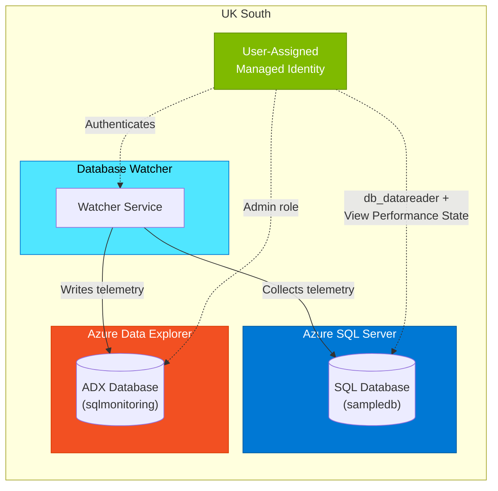

# Database Watcher Deployment

Deploy Azure SQL Server with a database, Database Watcher, and Azure Data Explorer (ADX) for telemetry logging — all in **UK South**.

## Architecture



| Resource | Purpose |
|---|---|
| Azure SQL Server + Database | The monitored SQL database |
| Azure Data Explorer (Kusto) | Stores monitoring telemetry collected by Database Watcher |
| Database Watcher | Continuously collects performance and health telemetry from SQL |
| User-Assigned Managed Identity | Authenticates the watcher to both SQL and ADX |

## Prerequisites

- Azure CLI (`az`) installed and authenticated
- An Azure subscription with permission to create resources
- `jq` installed (used by the deploy script)

## Quick Start

### 1. Clone and deploy

```bash
git clone https://github.com/mhaywardhill/database-watcher-deployment.git
cd database-watcher-deployment
./deploy.sh
```

You can customise the deployment with environment variables:

```bash
export RESOURCE_GROUP="rg-my-watcher"
export SQL_SERVER_NAME="sql-myserver"
export SQL_ADMIN_LOGIN="myadmin"
export SQL_ADMIN_PASSWORD="<your-password>"
export ADX_CLUSTER_NAME="adxmycluster"
export WATCHER_NAME="watcher-mydb"
./deploy.sh
```

### 2. Grant SQL permissions (required)

After deployment, connect to your SQL database and run:

```sql
CREATE USER [id-<watcher-name>] FROM EXTERNAL PROVIDER;
ALTER ROLE [db_datareader] ADD MEMBER [id-<watcher-name>];
GRANT VIEW DATABASE PERFORMANCE STATE TO [id-<watcher-name>];
GRANT VIEW SERVER PERFORMANCE STATE TO [id-<watcher-name>];
```

Replace `<watcher-name>` with the name of your Database Watcher resource.

### 3. Start the watcher

The deploy script attempts to start the watcher automatically. If it didn't start (permissions not yet granted), start it from the Azure Portal or run:

```bash
az rest --method post \
  --url "https://management.azure.com/subscriptions/<sub-id>/resourceGroups/<rg>/providers/Microsoft.DatabaseWatcher/watchers/<watcher-name>/start?api-version=2024-10-01-preview"
```

### 4. Query telemetry in ADX

Open the ADX cluster URI from the deployment output and query the `sqlmonitoring` database. Example KQL:

```kql
// Active sessions over time
SqlDbActiveSessionsSnapshot
| where sample_time_utc > ago(1h)
| summarize avg(active_sessions) by bin(sample_time_utc, 1m)
| render timechart
```

## Files

| File | Description |
|---|---|
| `main.bicep` | Bicep template — all infrastructure resources |
| `main.parameters.json` | Parameter file template (fill in before using with `az deployment`) |
| `deploy.sh` | End-to-end deployment script |

## Clean Up

```bash
az group delete --name rg-database-watcher --yes --no-wait
```